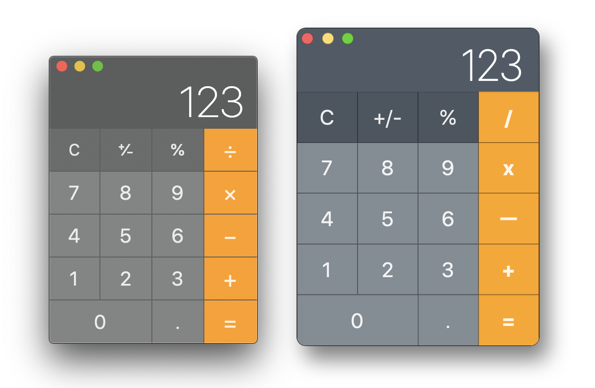

# MacOS Calculator

- [x] Operators
  + [x] Add
  + [x] Subtract
  + [x] Divide
  + [x] Multiply
  + [ ] Percent (`%`)
- [x] Other operations
  + [x] Equal (`=`)
  + [x] Clear (`C`)
- [x] Keyboard binding
